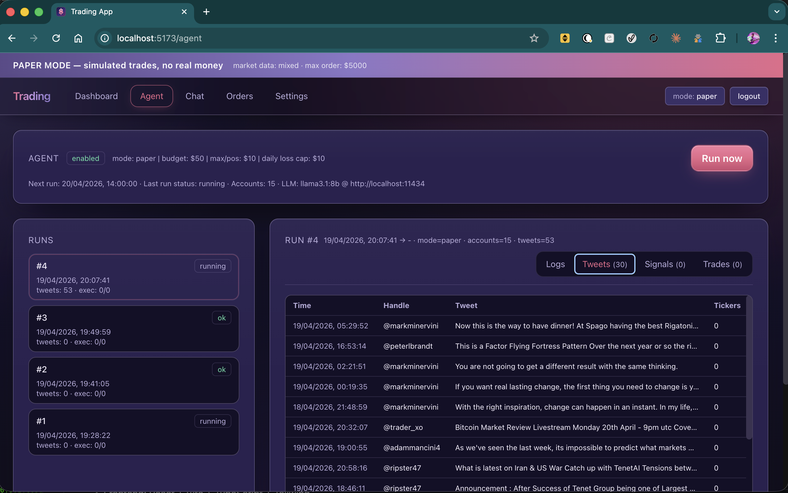

# Personal Stocks Trading App

Self-hosted trading app with **Paper** (preview) and **Live** modes, backed by Alpaca.



- Frontend: React + Vite + TypeScript + Tailwind (cosmic-purple theme)
- Backend: FastAPI + SQLite + SQLAlchemy
- Broker: Alpaca (paper + live)
- Mode toggle: `APP_MODE` env variable, resolved at startup
- Market data: pluggable, can mix WebSocket streaming and REST polling per symbol
- Agent: curated X timelines + local LLM -> paper trades with hard budget caps
- Market intelligence: scrapes stockanalysis.com (gainers/losers/most-active/screener) and TradingView news headlines to corroborate Twitter signals before sizing

## Quick start

### 1. Backend

```bash
cd backend
python3 -m venv .venv
.venv/bin/pip install -r requirements.txt
cp .env.example .env       # then fill in ALPACA_PAPER_KEY / ALPACA_PAPER_SECRET
.venv/bin/uvicorn app.main:app --reload
```

API: http://localhost:8000  (docs at `/docs`)

### 2. Frontend

```bash
cd frontend
npm install
npm run dev
```

UI: http://localhost:5173

### 3. First-run

1. Open the UI, register a local account (single user).
2. Add symbols to your watchlist (e.g. `AAPL`, `MSFT`, `TSLA`).
3. For each symbol, pick the feed: **WS** (websocket, low-latency) or **Poll** (REST every N seconds).
4. Place paper orders from the symbol page.

### 4. Switching to Live mode

1. Stop the backend.
2. Edit `.env`: set `APP_MODE=live` and fill `ALPACA_LIVE_KEY` / `ALPACA_LIVE_SECRET`.
3. Restart `uvicorn`. The UI banner turns red and every order requires confirmation.

## Safety rails (live mode)

- Mode is resolved once at boot - no in-app switch.
- Persistent red banner.
- Per-order confirmation dialog echoes the mode.
- Server-side `MAX_ORDER_NOTIONAL` cap.
- Orders/trades rows tagged with `mode`.
- `.env` is gitignored.

## Agent (X/Twitter + Ollama)

An optional background agent that scrapes recent tweets from a curated list of
investor X accounts, pipes each tweet through a local LLM to extract tickers +
sentiment, aggregates signals, and auto-trades in paper mode (propose-only in
live mode, unless `AGENT_AUTO_EXECUTE_LIVE=true`).

### One-time setup

1. **Install Ollama** and pull a model:
   ```bash
   brew install ollama
   ollama serve                       # in one terminal
   ollama pull llama3.1:8b            # ~4.7 GB
   ```

2. **Install Playwright + Chromium** (used to render each handle's timeline
   with auth cookies - X now gates recent tweets behind login even for public
   profiles):
   ```bash
   cd backend
   .venv/bin/pip install playwright
   .venv/bin/playwright install chromium
   ```

3. **Create a throwaway X account** (agent scraping will get your account
   rate-limited or banned, so do not use your real one). Log in to it from a
   real browser, grab the `auth_token` and `ct0` cookies from DevTools, then:
   ```bash
   cd backend
   .venv/bin/python -m app.services.agent.setup add_cookies
   # follow the prompts, paste auth_token and ct0 when asked
   .venv/bin/python -m app.services.agent.setup list
   ```

4. **Enable the agent** in `backend/.env`:
   ```
   AGENT_ENABLED=true
   AGENT_BUDGET_USD=200
   AGENT_WEEKLY_BUDGET_USD=200
   AGENT_MIN_POSITION_USD=20
   AGENT_MAX_POSITION_USD=40
   AGENT_DAILY_LOSS_CAP_USD=20
   AGENT_MAX_OPEN_POSITIONS=6
   AGENT_INTEL_BOOST=0.15
   AGENT_CRON_MINUTES=30
   OLLAMA_HOST=http://localhost:11434
   OLLAMA_MODEL=llama3.1:8b
   TWSCRAPE_DB=./twscrape.db
   TWITTER_ACCOUNTS=blondesnmoney,PeterLBrandt,LindaRaschke,...
   ```

5. Restart the backend. The **Agent** page in the UI shows status, past runs,
   per-ticker signals, and executed trades. Click **Run now** to trigger
   immediately instead of waiting for the next 30-minute slot.

### How it works

```
every 30m (mon-fri, 09:00-15:59 ET)
  -> Playwright (headless Chromium + twscrape cookies): last 24h of tweets per handle
     (falls back to twscrape API if Playwright is unavailable)
  -> Ollama chat (format=json): extract tickers + sentiment + confidence per tweet
  -> aggregate across all tweets -> per-ticker score, confidence, mentions
  -> market intel: stockanalysis.com gainers/losers/active/screener +
     tradingview.com news headlines, merged into a MarketIntel snapshot
  -> intel boost: corroborated tickers get +0.15 confidence; top losers drag
     bullish scores down to discourage chasing
  -> allocator: strength-weighted sizing in the $20-$40 band, clamped by
     remaining weekly + daily budget and AGENT_MAX_OPEN_POSITIONS
  -> risk gates: daily loss cap, weekly cap, skip already-held
  -> paper: auto-execute market orders
     live:  propose-only (unless AGENT_AUTO_EXECUTE_LIVE=true)
  -> portfolio advisor: a separate Ollama call returns a structured
     "Portfolio Today / New Ideas / Watchlist / Risk notes" recommendation
     stored on the run and rendered prominently in the UI
```

### Safety

- Hard caps: `AGENT_BUDGET_USD`, `AGENT_MAX_POSITION_USD`,
  `AGENT_DAILY_LOSS_CAP_USD` applied server-side every run.
- Global `MAX_ORDER_NOTIONAL` still applies to every order.
- `APP_MODE=live` + `AGENT_AUTO_EXECUTE_LIVE=false` means live mode only ever
  *proposes* trades - you still have to execute them manually.

## Project layout

```
trading-app/
  backend/   FastAPI + SQLite + Alpaca + Agent (twscrape + Ollama)
  frontend/  React + Vite + TS + Tailwind
```
